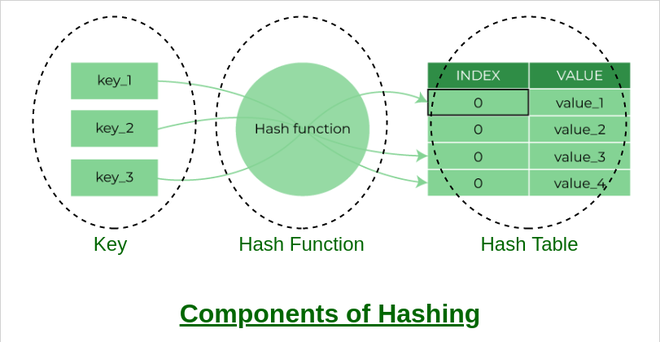
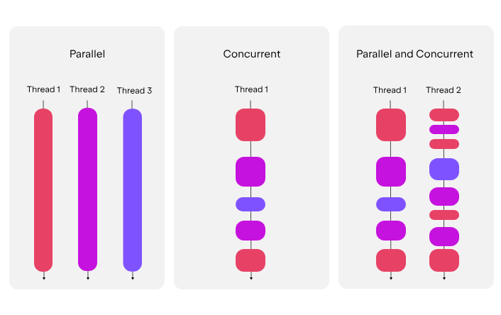
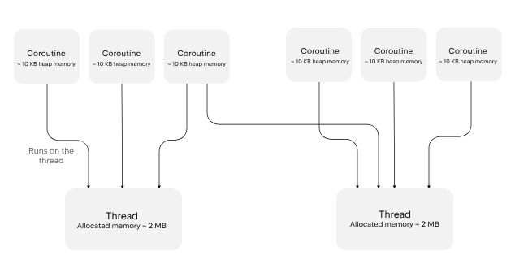

# Kotlin Basic Learning Repository

Repo luyện tập kiến thức Kotlin cơ bản từ syntax đến coroutines.

## 📚 Nội dung học tập

### 1. **Cú pháp cơ bản**
- Variables & Constants (`var`, `val`)
- Data Types: `Int`, `String`, `Boolean`, `Double`...
- Operators & Type Casting
- String Templates: `"Hello, $name"`

### 2. **Control Flow**
- `if-else`, `when` statements
- Loops: `for`, `while`, `do-while`

### 3. **Collections**
- `List`, `Set`, `Map`
- Functions: `map()`, `filter()`, `forEach()`...

### 4. **Functions**
- Regular & single-expression functions
- Extension functions
- Default parameters

### 5. **Null Safety**
- Nullable types (`?`)
- Safe calls (`?.`), Elvis operator (`?:`)

### 6. **OOP**
- Classes, Objects, Inheritance
- Data classes, Interfaces
- Companion objects

### 7. **Functional Programming**
- Lambda expressions: `{ x, y -> x + y }`
- Higher-order functions

### 8. **Coroutines**
- `suspend` functions
- `launch`, `async`
- Dispatchers & Scopes

### 9. **Advanced Topics**
- Sealed classes, Generics
- Reflection, DSL

## Visual References

**Collections Structure**

**Hash Table**

**Coroutines**

